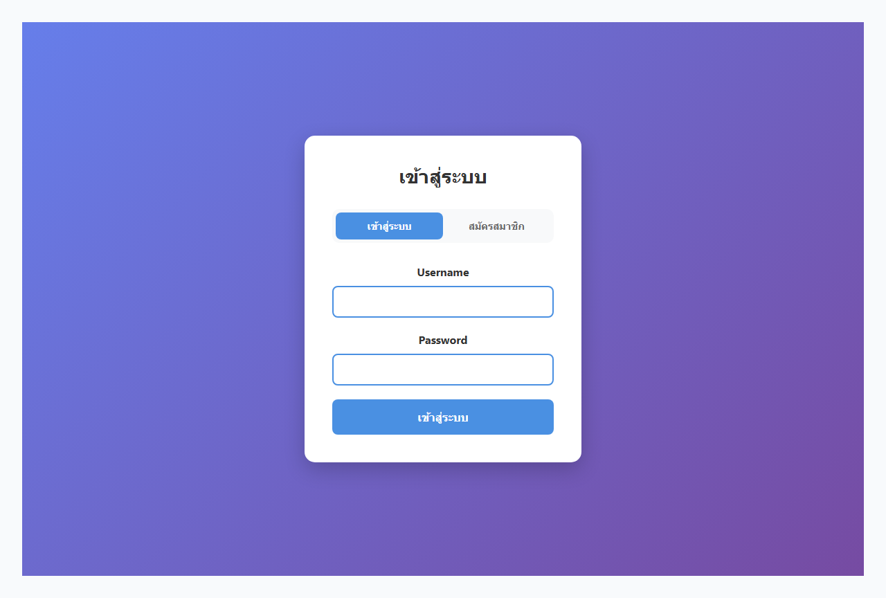
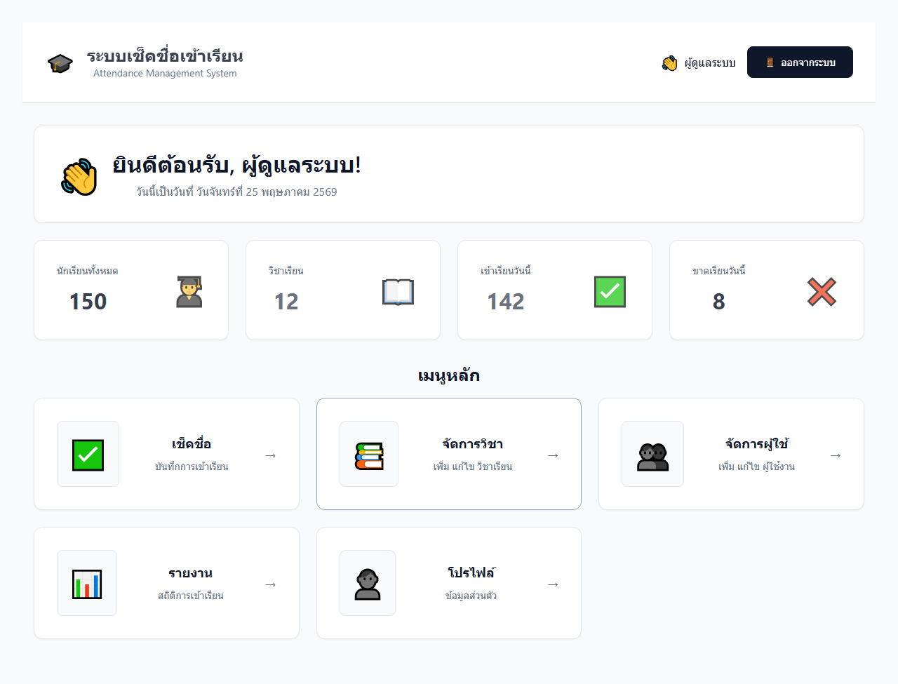

# ระบบเช็คชื่อเข้าเรียน (Attendance Management System)

## หน้า Login

หน้าเข้าสู่ระบบมี 2 โหมด:
- **เข้าสู่ระบบ** — ใส่ Username และ Password
- **สมัครสมาชิก** — สำหรับสร้างบัญชีใหม่

### บัญชีผู้ใช้เริ่มต้น

| Username | Password | ชื่อ |
|----------|----------|------|
| `admin` | `password` | ผู้ดูแลระบบ |
| `teacher1` | `password` | อาจารย์สมศักดิ์ |
| `teacher2` | `password` | อาจารย์วิไล |

---

## หน้า Dashboard

แสดงภาพรวมของระบบประกอบด้วย:

| ข้อมูล | ค่า |
|--------|-----|
| นักเรียนทั้งหมด | 150 คน |
| วิชาเรียน | 12 วิชา |
| เข้าเรียนวันนี้ | 142 คน |
| ขาดเรียนวันนี้ | 8 คน |

### เมนูหลัก

| เมนู | คำอธิบาย |
|------|----------|
| เช็คชื่อ | บันทึกการเข้าเรียน |
| จัดการวิชา | เพิ่ม แก้ไข วิชาเรียน |
| จัดการผู้ใช้ | เพิ่ม แก้ไข ผู้ใช้งาน |
| รายงาน | สถิติการเข้าเรียน |
| โปรไฟล์ | ข้อมูลส่วนตัว |

